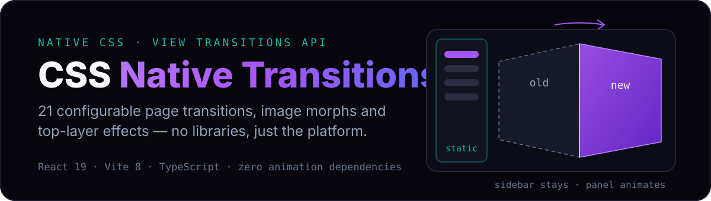

<p align="center">
  
</p>

<p align="center">
  <a href="https://nandiraju.github.io/CSS_Native_transitions/"><strong>▶&nbsp; Live demo</strong></a>
  &nbsp;·&nbsp;
  <a href="#the-transition-catalog">Transition catalog</a>
  &nbsp;·&nbsp;
  <a href="#how-it-works">How it works</a>
  &nbsp;·&nbsp;
  <a href="#run-it-locally">Run it locally</a>
</p>

<p align="center">
  <a href="https://github.com/nandiraju/CSS_Native_transitions/actions/workflows/deploy.yml"></a>
</p>

Every animation in this app — full-page cube rotations, Keynote-style blinds and reflections, images flying between pages, dialogs sliding out of the top layer — is done by the browser itself. No Framer Motion, no GSAP, no react-transition-group. The JavaScript does exactly one thing: change React state inside `document.startViewTransition()`. CSS does everything else.

Pick any transition on the **Settings** page and it applies to all navigation, persisted across reloads. In browsers without the View Transitions API the app falls back to instant navigation — the hard cut is the fallback, not an error.

## The transition catalog

| Group | Transitions | The CSS doing the work |
| --- | --- | --- |
| Effects | Fade · Cinema Scale · Wipe Reveal · Circle Clip Reveal | keyframes on the old/new snapshots; the circle expands from your actual click via `--click-x/y` custom properties |
| Fancy | Focus Blur · Center Split · Velocity Skew · Reflection | `filter: blur`, `clip-path` seam reveal, skewed motion, and a `-webkit-box-reflect` glossy stage |
| Blinds | Down · Up · Left · Right — slat size adjustable in Settings | an animatable `@property` ratio driving a `repeating-linear-gradient` mask |
| Slide | Left · Right · Up · Down | plain `translate` keyframes, clipped to the panel |
| 3D Cube | Left · Right · Up · Down | `perspective` + `preserve-3d` snapshots pivoting half a panel-width behind the screen |
| 3D Flip | Card Flip · Swing Doors | in-place and edge-hinged `rotateY`, sequenced with animation delays |

The sidebar never moves: page transitions animate a dedicated `main-content` snapshot (`view-transition-name` scoped by a class on `<html>`), and `::view-transition-group(main-content) { overflow: clip }` keeps every effect inside the panel.

## Shared images between two pages

Thumbnails on the Dashboard, gallery cards, and the detail hero all tag the same image with the same `view-transition-name: anomaly-<id>`. Navigate between those pages and the browser morphs the image across the DOM swap — position, size, and aspect ratio. A single `view-transition-class: anomaly-media` rule tunes every morph at once:

```css
::view-transition-group(.anomaly-media) {
  animation-duration: 0.45s;
  animation-timing-function: cubic-bezier(0.22, 1, 0.36, 1);
}
```

## How it works

The entire JavaScript pattern, used for navigation, tabs, and the theme toggle:

```tsx
const info = TRANSITIONS[pageTransition];
document.documentElement.classList.add('content-transition', info.className);

const transition = document.startViewTransition(() => {
  flushSync(() => setSection(newSection)); // React commits synchronously
});

transition.finished.finally(() => {
  document.documentElement.classList.remove('content-transition', info.className);
});
```

The class on `<html>` selects which keyframes apply to the snapshots:

```css
html.cube-left-transition::view-transition-old(main-content) {
  animation: cube-out-left 0.7s cubic-bezier(0.65, 0.05, 0.36, 1) both;
}
```

Details worth stealing:

- **Scoped snapshots** — `html.content-transition .main-content { view-transition-name: main-content }` lifts only the panel into its own snapshot; the theme toggle omits the class so its circular reveal covers the whole viewport.
- **Coordinate-aware reveals** — clip-path circles resolve in the snapshot's own coordinate space, so click coordinates are translated relative to the panel before being written to `--click-x/y`.
- **Animatable gradients** — the blinds animate a registered `@property --blinds-slat` number; the mask's gradient re-resolves every frame. Slat thickness is just a CSS variable set from a slider.
- **3D without breakage** — `perspective` and `preserve-3d` live on `::view-transition-image-pair`, with `isolation: auto` because the UA default `isolate` is a 3D-flattening grouping property. So is `overflow` — the panel clip stays on the *group*, never the image-pair.
- **Safari smoothness** — image-morph snapshots get `width/height: 100%` + `object-fit: cover` and short durations; Safari renders morphs on the main thread and stutters without them.
- **Accessible by default** — `prefers-reduced-motion` disables every `::view-transition-*` animation.

## Top layer, no JavaScript timers

The dialog, side drawer, and popover animate entry *and* exit purely in CSS using the `@starting-style` triad on native `<dialog>` and Popover API elements:

```css
dialog.modern-dialog          { opacity: 0; display: none;
                                transition-behavior: allow-discrete; }
dialog.modern-dialog[open]    { opacity: 1; display: flex; }
@starting-style {
  dialog.modern-dialog[open]  { opacity: 0; }
}
```

`transition-behavior: allow-discrete` lets `display: none` and `overlay` participate in transitions, so elements animate out before leaving the DOM — no `setTimeout`, no exit-animation libraries. List items animate in the same way on creation.

## Run it locally

```bash
git clone https://github.com/nandiraju/CSS_Native_transitions.git
cd CSS_Native_transitions
npm install
npm run dev
```

`npm run build` type-checks and produces the static bundle; pushes to `main` auto-deploy to GitHub Pages.

## Browser support

| Browser | Result |
| --- | --- |
| Chrome / Edge 111+ | everything |
| Safari 18+ | everything (18.2+ for the reflection stage) |
| Firefox | instant navigation fallback; top-layer `@starting-style` animations work from 129+ |

The app feature-detects `document.startViewTransition` — unsupported browsers get a working app with hard cuts.

## Stack

React 19 · Vite 8 · TypeScript · oxlint — and zero animation dependencies, which is the whole point.
